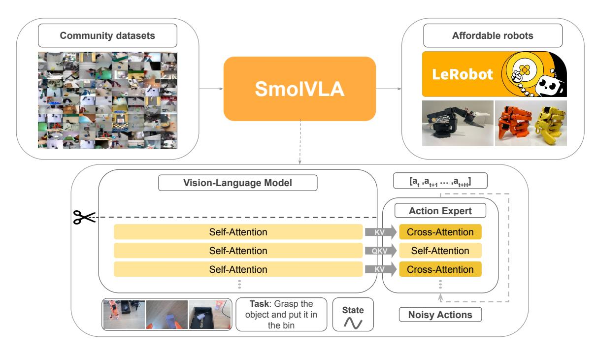
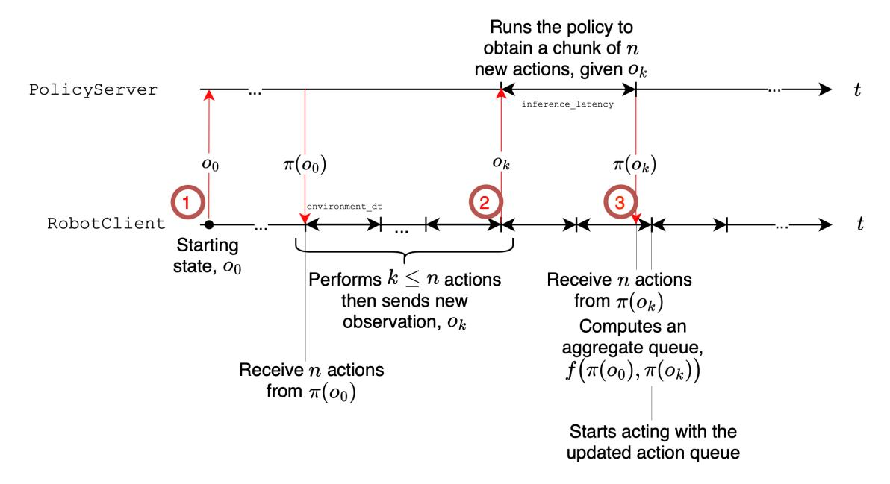
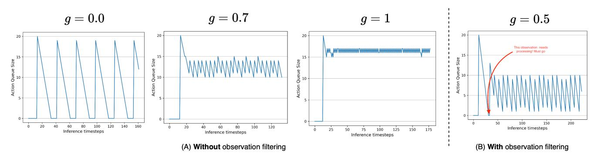
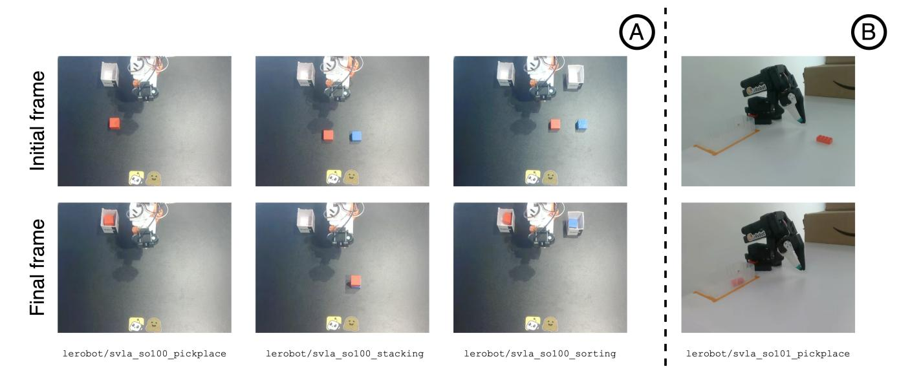

# SmolVLA：一种经济高效且可及的机器人视觉-语言-动作模型

Mustafa Shukor\* Dana Aubakirova\* Francesco Capuano\* Established

Pepijn Kooijmans® Steven Palma® Adil Zouitine® Michel Aractingi® Caroline Pascal® Martino Russi® Andres Marafioti® Simon Alibert® Matthieu Cord® Thomas Wolf® Remi Cadene®

$^{\underline{a}}$  Hugging Face,  ${\S}$  索邦大学,  $^{v}$  valeo.ai,  ${\buildrel =}$  巴黎萨克雷高等师范学校  ${\buildrel *}$  核心团队

#### **摘要**

在大规模多模态数据上预训练的视觉-语言模型（VLMs）编码了丰富的视觉与语言知识，因此成为机器人领域的强大基石。近期的研究并非从头训练机器人策略，而是将VLM适配为视觉-语言-动作（VLA）模型，以实现自然语言驱动的感知与控制。然而，现有VLA通常规模庞大——往往具有数十亿参数——导致训练成本高昂且实际部署受限。此外，它们主要依赖学术和工业数据集，忽视了日益增长的来自低成本机器人平台的社区收集数据。本文中，我们提出了SmolVLA，一个体积小、效率高并由社区驱动的VLA模型，在保持有竞争力性能的同时极大降低了训练与推理成本。SmolVLA设计为可在单个GPU上训练，并在消费级GPU甚至CPU上部署。为进一步提升响应性，我们引入了一种异步推理栈，将感知与动作预测与动作执行解耦，利用分块动作生成实现更高的控制频率。尽管尺寸小巧，SmolVLA 的性能可与参数规模达其10倍的VLA相媲美。我们在一系列模拟和真实机器人基准上评估了SmolVLA，并开源了所有代码、预训练模型和训练数据。

图1 | SmolVLA。SmolVLA由一个紧凑的预训练视觉-语言模型构成，丢弃了最后 L−N 层（剪刀图标）。剩余层嵌入三种输入：(i) 语言指令，(ii) RGB 图像，(iii) 机器人感知运动状态。它们合并后的 token 输入一个动作专家模块，该模块由交替的交叉注意力（金色）和自注意力（浅黄色）块组成，并使用流匹配训练以输出 $n$ 个底层动作块 $a_t, \ldots, a_{t+n}$。SmolVLA 在公开社区数据集上预训练，并在低成本机器人上评估。

## **1 引言**

近年来，该领域趋向于开发基础模型——能够执行各类任务的通用模型。这一趋势的一个显著例子是大语言模型（LLMs），它们在理解和生成自然语言、复杂话题推理及知识锚定方面已表现出与人类平均水平相当的性能 [Brown et al., 2020; Achiam et al., 2023; Dubey et al., 2024; Team et al., 2023; Jiang et al., 2023]。因此，基于文本的模型的成功被拓展到其他模态，引发了对多模态视觉-语言模型（VLMs）[Alayrac et al., 2022; Chen et al., 2023; Huang et al., 2023; Liu et al., 2023b; Chen et al., 2024; Shukor et al., 2023b] 和音频-语言模型（ALMs）[Défossez et al., 2024; Das et al., 2024; Borsos et al., 2023] 的兴趣。尽管模态上互为补充，这些多模态基础模型的进步均源自 (i) 采用可扩展架构，如 Transformer [Vaswani, 2017]，以及 (ii) 互联网规模的训练数据集。

尽管在数字世界取得了瞩目成就，基础模型在现实世界中的实际应用——尤其是在机器人领域——仍然有限。特别是，机器人策略 [Zhao et al., 2023; Chi et al., 2024; Lee et al., 2024; Hansen et al., 2022] 在跨物体类型、位置、环境和任务的泛化方面仍面临挑战 [Xie et al., 2024; Ebert et al., 2021]。机器人应能适应新环境和新物体，这就需要稳健的技能和对世界的常识理解。然而，这一方向的进展似乎常常受限于高质量多样性数据的可用性。

为应对这一限制，越来越多的研究开始探索以视觉-语言-动作（VLA）模型形式的机器人基础模型 [Team et al., 2024; O'Neill et al., 2024; Brohan et al., 2023; Kim et al., 2024; Black et al., 2024; Bjorck et al., 2025; Li et al., 2024; Huang et al., 2024]。VLA 旨在融合嵌入在预训练大语言模型和视觉-语言模型中的抽象推理、世界知识和决策技能。这些模型接收多模态输入——如视觉观测和自然语言指令——并预测相应的机器人动作。早期结果显示出在泛化能力方面的可喜进展 [Black et al., 2024; Brohan et al., 2023]。

VLA 模型仍处于早期开发阶段，尚未像 LLM 和 VLM 那样成熟或被广泛采用。许多有影响力的 VLA 进展仍属专有，许多模型仅分享权重而隐藏完整的训练细节和关键方法组件。虽然它们在学术基准上有效，但我们认为，实现机器人的类人能力需要更坚定的开源承诺。具体而言，透明、可复现的开源模型和训练配方对于加速进展和促进机器人研究界更广泛参与至关重要。我们倡导开发经济高效、可及性强且面向更广大社区的模型。尽管 OpenVLA [Kim et al., 2024] 和 RT-2-X [O'Neill et al., 2024] 等鼓舞人心的努力证明了开放 VLA 系统的可行性，但它们体积仍然庞大、资源密集且依赖于昂贵的机器人平台，从而限制了可及性。

在本文中，我们介绍了 SmolVLA，一项开源倡议，其特点为一个紧凑而高性能的 VLA 模型，并附带可复现且高效的训练与推理配方。我们的贡献如下：

- **轻量架构。** 我们提出 SmolVLA，一种紧凑高效的视觉-语言代理，针对消费级 GPU 训练和 CPU 部署进行了优化。关键设计选择包括：(i) 跳过 VLM 中的层，(ii) 使用极少量的视觉 token，(iii) 利用小型预训练 VLM，以及 (iv) 将自注意力层与较轻的交叉注意力层交错安排。
- **基于社区驱动数据集的预训练。** SmolVLA 在整个少于 3 万个轨迹的完全公开、社区贡献数据集上进行端到端训练，同时使用比先前方法少一个数量级的数据展示出强劲性能。
- **异步推理。** 我们引入了一种优化的异步推理栈，将动作执行与观测处理及动作预测解耦，降低延迟并实现快速、资源高效的推理。

我们在模拟环境和真实世界多个任务上评估了 SmolVLA。有趣的是，尽管规模显著较小，SmolVLA 的性能与规模大得多的 VLA 模型相当甚至超越它们。

## **2 相关工作**

**视觉-语言模型（VLMs）。** VLM 设计用于处理视觉和文本模态——最常见的方式是以图像和文本为输入，并生成以视觉上下文为条件的文本输出。VLMs 的最新进展受 LLM 成功的推动，许多方法基于预训练 LLM 并采用类似的训练范式。通常，VLMs [Alayrac et al., 2022; Laurençon et al., 2024; Lin et al., 2023a] 通过将预训练的视觉编码器 [Radford et al., 2021; Zhai et al., 2023; Fini et al., 2024] 与预训练的 LLM [AI@Meta, 2024; Jiang et al., 2023; Wang et al., 2024] 结合来构建。训练接着分多个多模态阶段进行，首先在图像-标题数据集 [Schuhmann et al., 2022; Byeon et al., 2022] 和交错视觉-语言语料库 [Laurençon et al., 2023; Zhu et al., 2023] 上进行大规模预训练，然后在指令微调数据集上进行监督微调阶段 [Liu et al., 2023b; Tong et al., 2024; Laurençon et al., 2024]。其他工作展示了不依赖预训练视觉编码器的好处 [Bavishi et al., 2023; Shukor et al., 2025; Diao et al., 2025, 2024]，而另一些工作旨在开发更统一的架构，将图像和文本均表示为离散 token，使单一模型能处理多模态 token 序列 [Wang et al., 2022; Shukor et al., 2023b; Team, 2024; Lin et al., 2024]。效率也已成为 VLM 研究的核心焦点。一些工作旨在通过使用更小、更多样化的数据集 [Liu et al., 2023b; Dai et al., 2023; Bai et al., 2025; Zhu et al., 2024; Tong et al., 2024]、训练更小规模的模型 [Marafioti et al., 2025; Korrapati, 2024; Yao et al., 2024]，或通过仅调整预训练单模态模型的一小部分参数来适配 [Shukor et al., 2023a; Vallaeys et al., 2024; Mañas et al., 2023; Koh et al., 2023; Tsimpoukelli et al., 2021; Li et al., 2023] 来降低训练成本。尽管大多数 VLM 研究聚焦图像和文本模态，但近期工作表明类似技术可以扩展到整合更多模态，如视频和音频 [Wang et al., 2025; Liu et al., 2024; Zhang et al., 2025; Kong et al., 2024]。

**视觉-语言-动作模型（VLAs）。** 机器人研究中的一个日益增长的领域是开发通用策略——能够执行广泛任务、在不同环境和机器人形态间泛化的模型。一个突出的策略方向是利用 VLA，即能处理 (i) 自然语言任务指令，(ii) 视觉观测（例如来自相机流的图像），以及 (iii) 本体感觉输入以输出控制动作的模型。早期努力如 Octo [Team et al., 2024] 和 RT-1 [O'Neill et al., 2024] 在大规模机器人演示数据集上从头训练基于 Transformer 的模型。为提高性能和泛化能力，RT-2 [Brohan et al., 2023] 利用了预训练的视觉-语言模型（VLM），并在机器人特定数据上进一步训练。为促进开放性和可复现性，OpenVLA [Kim et al., 2024] 发布了一个 7B 参数的 VLA，在公开可用数据上训练以生成离散动作 token。由于动作 token 化对连续控制存在局限，π0 [Black et al., 2024] 和 DexVLA [Wen et al., 2025] 提出使用基于扩散的解码器进行连续动作生成。其中，Black et al. (2024) 和 Wen et al. (2025) 均提出适配预训练 VLM，RDT-1B，引入一个大的扩散组件——称为动作专家——直接在机器人演示上训练。最近，Pertsch et al. (2025) 提出了一种使用新型动作 token 化器的全自回归方法，改进了传统分箱方法，但仍然受限于（自回归）推理速度慢。为提高 VLA 的效率，TinyVLA [Wen et al., 2024] 从头训练了一个轻量级 1B 以下模型于多模态数据上，然后在机器人数据集上微调，然而缺少大规模机器人数据预训练阻碍了更广泛的泛化能力。SmolVLA 与这些努力有着相似的目标，旨在开发并发布在训练和推理上都高性能且高效的开源模型。

# **3 SmolVLA：小巧、高效且高性能**

**概述。** SmolVLA 是一个轻量级 VLA，由一个紧凑的预训练 VLM 和一个使用流匹配训练的动作专家组成。给定多张图像和描述任务的语言指令，模型输出一组动作块。它首先通过模仿学习在社区收集的数据集上进行预训练，然后在真实世界和模拟环境中进行评估。预训练数据旨在覆盖多样化的任务和行为，使模型能学习可跨场景迁移的通用物理技能。在推理时，我们引入了一个异步执行栈，将动作执行与感知和预测解耦，从而实现更快、更具响应性的控制。

#### **3.1 模型架构**

SmolVLA 由两个主要组件构成：(i) 一个预训练的 VLM，负责感知，以及 (ii) 一个动作专家，负责行动。两个组件相互连接，VLM 处理状态输入以生成特征，这些特征条件化动作专家，而动作专家产生的动作又会改变馈入 VLM 的状态。具体来说，VLM 处理感知运动状态，包括来自多个 RGB 相机的图像，以及描述任务的语言指令。随后，VLM 输出特征直接馈入动作专家，后者输出最终的连续动作。

**视觉-语言模型（VLM）。** 我们采用预训练 VLM 作为感知机器人环境的主干。VLM 在多样化多模态数据上预训练，捕获丰富的世界知识。为保证效率与可及性，我们选择 SmolVLM-2 (Marafioti et al., 2025)，这是一个针对多图像和视频输入优化的高效模型。SmolVLM-2 依靠 SigLIP (Zhai et al., 2023) 编码视觉特征，供 SmolLM2 语言解码器 (Allal et al., 2025) 使用。在 SmolVLA 中，VLM 组件使用视觉编码器处理图像序列，并通过一种 token 混洗技术减少 token 数量以提高效率。语言指令被 token 化为文本 token。感知运动状态通过线性层投影为单个 token 以匹配语言模型的 token 维度。最后，视觉、语言和状态 token 被拼接并传递给语言解码器。解码器层得到的结果随后用于条件化动作专家。

**状态、动作和特征投影器。** 我们在 SmolVLA 内部多个位置使用线性投影层。具体来说，我们使用线性投影层来 (i) 将状态投影以匹配 VLM 维度，(ii) 将动作投影以匹配动作专家维度，以及 (iii) 调整 VLM 特征以与动作专家的维度对齐。

**视觉 token 缩减。** 尽管对 VLM 性能至关重要，高分辨率图像会增加推理成本。为保证效率，SmolVLM-2 使用图像平铺技术 (Lin et al., 2023b) 进行训练，这是一种处理同一图像多个裁剪块的流行方法，此外还有全局图像。然而，为获得更快的推理时间，我们不使用平铺，仅使用全局图像以及像素混洗操作，将每帧的视觉 token 限制为 64。

**通过跳层实现更快推理。** 为获得更快的推理时间，我们跳过 VLM 中的部分计算。先前工作 [Shukor and Cord, 2024; Tang et al., 2023] 已证明可以在不显著降低性能的情况下跳过预训练模型中的层。最近，[El-Nouby et al., 2024; Bolya et al., 2025; Rajasegaran et al., 2025] 表明，下游任务的最佳特征不一定来自 VLM 的最后一层。因此，我们的动作专家不再使用最后一层特征，而是可以访问直到指定层 N 的所有特征。在实践中，我们发现将 N 设为总层数的一半（N = L/2）可在速度和性能之间提供良好权衡，实际上将 LLM 和动作专家的计算成本减半。

**流匹配动作专家。** 动作专家 $\mathbf{v}_{\theta}$ 训练用于根据 VLM 特征预测动作块 $\mathbf{A}_{t} = (a_{t}, \dots, a_{t+n})$。与先前工作一致，我们对 $\mathbf{v}_{\theta}$ 的实现基于 Transformer 架构 [Vaswani, 2017]。与之前的 VLA 架构不同，我们交替使用交叉注意力层和自注意力层，从而采用一个条件流匹配 Transformer [Esser et al., 2024; Liu, 2022; Lipman et al., 2022] 作为 $\mathbf{v}_{\theta}$。动作专家使用以下定义的目标进行训练：

$$\mathcal{L}^{\tau}(\theta) = \mathbb{E}_{p(\mathbf{A}_{t}|\mathbf{o}_{t}), q(\mathbf{A}_{t}^{\tau}|\mathbf{A}_{t})} \left[ \left\| \mathbf{v}_{\theta}(\mathbf{A}_{t}^{\tau}, \mathbf{o}_{t}) - \mathbf{u}(\mathbf{A}_{t}^{\tau} \mid \mathbf{A}_{t}) \right\|^{2} \right],$$

其中 $\mathbf{o}_t$ 表示从观测 $o_t$ 在第 N 个 VLM 层提取的 VLM 特征，$\mathbf{A}_t^{\tau} = \tau \mathbf{A}_t + (1-\tau)\epsilon$，其中 $\epsilon \sim \mathcal{N}(0, \mathbf{I})$。特别地，$\mathbf{v}_{\theta}$ 被训练为根据 VLM 特征和加噪动作 $\mathbf{A}_t^{\tau}$ 输出向量场 $\mathbf{u}(\mathbf{A}_t^{\tau} \mid \mathbf{A}_t) = \epsilon - \mathbf{A}_t$。与 Black et al. (2024) 一致，我们从 Beta 分布采样 $\tau$。为了提高推理效率，我们为 $\mathbf{v}_{\theta}$ 使用缩减的隐藏尺寸 $0.75 \times d$，其中 $d$ 是 VLM 的隐藏维度。

**交替交叉注意力和因果自注意力层。** 动作专家 $\mathbf{v}_{\theta}$ 生成条件化于 VLM 特征的动作块，而 SmolVLA 中 VLM 与动作专家之间的交互通过注意力机制实现。与先前仅依赖自注意力（SA）[Black et al., 2024] 或交叉注意力（CA）[Bjorck et al., 2025] 的工作不同，我们采用交替方法，每个块包含一个 CA 或 SA 层。这一设计也不同于标准 VLM 架构，后者每个解码器块通常同时包含 SA 和 CA 层 [Laurençon et al., 2023; Alayrac et al., 2022; Chen et al., 2022]。在动作专家的前向传播中，动作与 VLM 特征通过注意力交互，将 token 投影为查询、键和值 [Vaswani, 2017]。在我们的设置中，CA 层交叉关注 VLM 的键和值，而 SA 层允许 $\mathbf{v}_{\theta}$ 中的动作 token 互相关注。我们对 SA 层使用因果注意力掩码，确保每个动作 token 只能关注块内过去的 token，防止未来动作依赖。经验上，我们发现交替使用 CA 和 SA 层可带来更高的成功率和更快的推理时间。特别是，我们发现自注意力有助于生成更平滑的动作块 $\mathbf{A}$，这在实际机器人评估中尤为明显。

## **3.2 由社区收集的预训练数据**

在机器人领域，可用于大规模预训练的数据仍比推动视觉和语言近期突破的数据小多个数量级。例如，自然语言基础模型可受益于独特的文本接口和互联网海量数据，但机器人数据集的整合与扩展显得复杂，原因包括 (i) 不同数据集之间的差异，以及 (ii) 依赖人类专家的遥操作进行数据收集。此外，机器人形态、传感器、驱动方式、控制频率和数据格式的高异质性导致出现“数据孤岛”[Bjorck et al. (2025)]——分散的机器人数据集整合十分困难。

在此背景下，低成本机器人平台和标准化机器人库的出现直接缓解了这种数据异质性，为实践者提供了进入机器人领域的独特切入点。进一步地，由个人实践者贡献的开源数据通过社区数据集为更广大的机器人社区赋能，这些数据集收集于多样的真实环境——从学术实验室到家庭——作为通过开源去中心化和扩展机器人学习的更大努力的一部分。与遵循标准化协议的学术数据集不同，社区数据集天然跨越了不同的机器人形态、控制方案、相机视角和任务。此外，社区数据集通过嘈杂演示、异质环境和多样物体交互反映了现实世界的复杂性，从而作为预训练数据极具价值。在这项工作中，我们从 Hugging Face 选取了 481 个社区数据集的子集，按照机器人形态类型、轨迹数、整体数据质量和帧覆盖范围进行过滤（表 1）。

**使用 VLM 标注任务。** 依赖社区贡献数据集会带来标准化挑战。特别是，我们观察到任务标注——对给定数据集机器人预期行为的自然语言描述——中存在大量噪声。关键的是，不同数据集包含诸如 "task desc" 之类的模糊占位符、过于含糊的指令如 "Hold" 或 "Up"，或完全缺失指令。为提高标注质量，我们使用了一个现成的 VLM（Qwen2.5-VL-3B-Instruct）来自动生成简洁的任务描述。对每个数据集，我们采样代表性帧，并将其与原始指令一同提供给模型。

| # 数据集 | # 轨迹数 | # 帧数 |
|----------|----------|-------|
| 481      | 22.9K    | 10.6M |

**表 1** ∣ **社区数据集统计。** 在约 1000 万帧的规模下，我们的预训练集至少比其他最先进方法小一个数量级。完整列表中社区数据集见附录 A.1。

模型被提示生成一个简短、面向动作的句子来概括行为。完整提示见附录 A.1。

**相机视角标准化。** 使用社区数据集的另一个挑战是相机命名惯例的高度可变性。例如，数据集中的 images.laptop 可能根据具体情况指代顶部、侧面或腕部视角。我们发现这种不一致在预训练中有害，而一致的相机排序在此数据规模下对训练颇有裨益。为解决这一标准化挑战，我们手动将每个相机映射到标准化视角类型——优先采用顶部、腕部和侧面视角——并分别重命名为 OBS_IMAGE_1, OBS_IMAGE_2, OBS_IMAGE_3。对于有其他视角的数据集，顺序被保留，但训练中未使用的视角会被丢弃。未来工作可借助 VLM 自动化此过程，或提出/采用标准化的数据收集指南。

## **3.3 异步推理**

现代视觉运动策略 [Zhao et al., 2023; Chi et al., 2023; Black et al., 2024] 输出动作块——序列 $\pi(o_t) = \mathbf{A}^{t}$，其中 $\mathbf{A}^{t} = (a^{t}, a^{t+1}, \ldots, a^{t+n})$ 为 $n$（远大于 1）个底层指令序列，被排入一个动作队列，源自环境观测 $o^{t}$。通常，机器人执行完整个动作块 $\mathbf{A}^{t}$ 后，再传递新观测 $o^{t+n}$ 给策略 $\pi$ 以预测下一块。这导致在每 $n$ 个时间步捕获的观测之间进行开环推理。包括 [Zhao et al. (2023); Chi et al. (2023)] 在内的研究采用不同策略，机器人控制器交替进行块预测 $\mathbf{A}^{t} \leftarrow \pi(o_t)$ 和块消费 $a^{t} \leftarrow \text{PopFront}(\mathbf{A}^t)$，在每个时间步 $t$ 计算新的动作块，并在重叠段上聚合预测块。虽然具有自适应性——处理每个时间步 $t$ 的每个观测 $o^{t}$——此类方法依赖于持续运行推理，这在资源受限场景（如边缘部署）中可能成本过高。

**图2** | **异步推理**。异步推理栈示意图。注意策略可在远程服务器上运行，可能配有 GPU。

一种资源密集度较低的方法是完全耗尽动作块 $\mathbf{A}$ 后再预测新动作块，我们将此策略称为同步推理。此外，同步推理每 $n$ 个时间步高效分配一次计算，从而降低控制时间内的平均计算负担。然而，这固有地妨碍了机器人系统的响应性，由于机器人在计算 $\mathbf{A}$ 时空闲而产生盲滞后。

我们通过将动作块预测 $\mathbf{A}$ 与动作执行 $a_t \leftarrow \text{PopFront}(\mathbf{A}_t)$ 解耦，开发了一个异步推理栈（算法 1），从而直接评估因开环执行导致的适应性不足及运行时的滞后问题。在此异步栈中，一个 Robot-Client 将观测 $o_t$ 发送至一个 Policy-Server，推理完成后接收动作块 $\mathbf{A}_t$（图 2）。通过这种方式，我们在控制回路仍消耗先前可用队列时触发块预测，并在新队列可用时将其与旧队列聚合，从而避免执行滞后。此外，异步推理通过提高处理观测的频率来收紧动作预测与动作执行之间的回路。最关键的是，将动作预测与动作执行解耦还直接允许在远程策略服务器上分配更多计算资源，并通过网络将动作发送到机器人客户端，这在低功耗机器人等资源受限场景中可能非常有效。

#### 算法 1 异步推理控制回路
1: 输入: 时间范围 $T$, 块大小 $n$, 阈值 $g \in [0,1]$
2: 初始化: 捕获 $o_0$; 发送 $o_0$ 到 POLICYSERVER; 接收 $\mathbf{A}_0 \leftarrow \pi(o_0)$
   对于 $t$ 到 $T$ 循环
3:
       $a_t \leftarrow \text{PopFront}(\mathbf{A}_t)$
4:
       执行($a_t$) $\triangleright$ 在时间步 $t$ 执行动作
5:
       如果 $\frac{|\mathbf{A}_t|}{n} < g$ 则
6:
          \> 队列低于阈值
          捕获新观测, $o_{t+1}$
7:
          如果 NeedsProcessing($o_{t+1}$) 则
8:
               \> 相似度过滤器，或触发直接处理
               $\text{async\_handle} \leftarrow \text{AsyncInfer}(o_{t+1})$
               \> 触发新块预测（非阻塞）
9:
               $\mathbf{\tilde{A}}_{t+1} \leftarrow \pi(o_{t+1})$
               \> 使用策略预测新队列
10:
               $\mathbf{A}_{t+1} \leftarrow f(\mathbf{A}_t, \mathbf{A}_{t+1})$
11.
               \> 聚合重叠（如有）
          结束如果
12:
13.
       如果 NotCompleted(async_handle) 则
14:
          \> 队列未更新（推理尚未完成）
          $\mathbf{A}_{t+1} \leftarrow \mathbf{A}_t$
15:
16:
17: 结束循环

**图3** | (A) 在不同阈值 $g$ 下动作队列大小在运行时的时间演变，未基于关节空间相似度过滤观测；(B) 过滤掉关节空间中的近重复观测后的队列大小。

**实现细节** 异步推理 (i) 通过更频繁地捕获观测来收紧控制回路，直接消除了运行时的空闲间隔，以及 (ii) 直接允许在比自主机器人平台通常可用的更强大计算资源上运行推理。

在算法上，我们通过消费现成队列中的动作直到队列剩余动作数满足阈值条件 $(|\mathbf{A}_t|/n < g)$ 来在 ROBOTCLIENT 侧实现 (i)。当此条件触发时，捕获一个新的环境观测并发送给（可能远程的）POLICYSERVER。为避免冗余的服务器调用和运行时的异常行为，观测在关节空间中进行比较，并丢弃近重复项。如果两个观测在关节空间中的距离低于预定阈值 $\epsilon \in \mathbb{R}_+$，则认为它们是近重复的。重要的是，当机器人客户端可用队列最终为空时，无论相似度如何，都会处理最近的观测。

有趣的是，异步推理的行为可以进行分析。首先，设 $\ell$ 为建模从发送观测 $o$ 到接收动作块 $\mathbf{A}$ 所需时间的随机变量，即 (i) 观测 $o$ 在 ROBOTCLIENT 与 POLICYSERVER 之间的发送时间 $t_{C \to S}$，(ii) POLICYSERVER 上的推理延迟 $\ell_S$，以及 (iii) $\mathbf{A}$ 在 POLICYSERVER 与 ROBOTCLIENT 之间的发送时间 $t_{S \to C}$ 之和。假设独立，$\mathbb{E}[\ell] = \mathbb{E}[t_{C \to S}] + \mathbb{E}[t_{S}] + \mathbb{E}[t_{S \to C}]$，并可进一步简化为 $\mathbb{E}[\ell] \cong \mathbb{E}[\ell_S]$，假设通信时间 (i) 双向相等且 (ii) 相对于推理延迟可忽略。其次，设 $\Delta t$ 为环境的控制周期。以 30 帧每秒的真实世界帧率，$\Delta t = 33$ ms。因此，当 $g \ge \frac{\mathbb{E}[\ell_S]/\Delta t}{n}$ 时，运行时空队列——即等待新块时空闲——得以避免。其中，队列阈值 $g$ 相对于 ROBOTCLIENT 可用动作的情况起主要作用。

图 3(A) 展示了三个代表性 $g$ 值下动作块大小 $|\mathbf{A}_t|$ 随时间演变，详述以下关键情景：

- **顺序极限（g = 0）**。客户端耗尽整个块后才向服务器发送新观测。在计算下一个块所需的往返延迟期间，队列为空，导致机器人*无法*行动。这再现了完全顺序部署的行为，并平均导致 $\mathbb{E}[\ell_S]$ 秒的空闲时间。
- **异步推理（g = 0.7）**。允许客户端在触发新动作队列 $\mathbf{A}_t$ 推理之前先消费前一个队列 $\mathbf{A}_{t-1}$ 的大约 $1-g = 0.3$ 比例，从而在防止队列耗尽的同时分摊计算。连续块之间的重叠提供了对建模误差的缓冲，而无需承担 g = 1 方案的完整成本。更新后的队列 $\mathbf{A}_t$ 通过聚合 $\mathbf{A}_{t-1}$ 和传入的 $\tilde{\mathbf{A}}_t$ 在重叠时间步上获得。
- **计算密集型极限（g = 1）**。作为极端情况，并遵循 Zhao et al. (2023); Chi et al. (2024) 的做法，在*每*个时间步发送观测。因此，队列几乎始终是满的，仅因 $\Delta t/\mathbb{E}[\ell_s] < 1$ 而有轻微锯齿状波动。尽管该方案反应最快，但每个控制节拍都要进行一次前向传播，在有限硬件上可能过于昂贵。重要的是，由于客户端在服务器计算下一块时消费动作，可用队列永远不会再次被完全填满。

图 3(A) 强调了由 $g$ 控制的权衡：小值会导致空闲期，而 $g \approx 1$ 则假设模型高度精确且付出显著计算代价。实际中，选择 $g \in (0,1)$ 可在反应性与资源预算之间取得平衡。若没有上述相似度过滤器，ROBOTCLIENT 将每 $(1-g)n \cdot \Delta t$ 秒发送一次观测进行处理，平均每 $(1-g)n \cdot \Delta t + \mathbb{E}[\ell_S]$ 秒接收一个新动作块。观测相似度过滤器的存在延长了该处理时间，并起到避免因队列不断被几乎相同的传入动作块整合而导致机器人停滞的作用。特别是，图 3(B) 显示，如果不过滤掉近重复观测，队列会被传入动作填满。为清晰起见，图 3(B) 中的红色箭头标出了一个绕过观测相似度机制的时间步，由于队列为空，强制处理了一个（几乎相同的）观测。

## 4 实验

#### 4.1 实验设置

我们在模拟和真实世界机器人操作任务上评估我们的模型。为在模拟中评估 SmolVLA，我们为 MetaWorld (Yu et al., 2020) 收集了一个新数据集，包含 50 个任务各 50 条演示。对于真实世界评估，我们使用 SO-100 机器人臂 (Knight et al.) 收集了 3 个数据集，并使用 SO-101 臂 (Knight et al.) 收集了 1 个数据集，每个对应不同的操作任务。每个数据集包含一个任务的演示，对 5 个不同的起始位置各 10 条轨迹，每个数据集共 50 条演示。数据集记录的轨迹相对于……除非另有说明，SmolVLA 始终在多任务设置中训练。

**评估指标。** 我们报告成功率作为所有基准的主要指标。对于基于仿真的评估，SR 为二值——如果任务成功完成则设为 1，否则为 0。对于真实世界评估，我们采用更细粒度的评分方法，将每个任务分解为子任务。例如，在 Pick-and-Place 任务中，成功抓取立方体得 0.5 分，正确将其放入目标容器再得 0.5 分。

**模拟环境。** 我们在两个已建立的多任务仿真基准上评估 SmolVLA：LIBERO (Liu et al., 2023a) 和 Meta-World (Yu et al., 2020)。LIBERO 在四个类别——Spatial、Object、Goal 和 Long——中评估多样化的视觉运动技能，每类 10 个任务（共 40 个）。我们使用一个包含所有任务共 1693 条轨迹的数据集 (Kim et al., 2024; Pertsch et al., 2025) 1，对每个任务评估 10 次试验，基于二进制完成标准报告平均成功率。Meta-World 在 50 个不同难度（简单、中等、困难和极难）的任务上评估泛化能力 (Seo et al., 2023)。我们使用一个包含 2500 条轨迹的数据集 2（每任务 50 条），并采用与 LIBERO 相同的评估协议：每任务 10 次试验，仅当任务完全完成时才评分为 1。

**真实世界任务。** 我们在真实世界环境中使用 4 个数据集评估 SmolVLA，这些数据集已在 Hugging Face 上开源（图 4）。具体来说，我们对 SO100 机器人基准测试了真实世界的 Pick-and-Place 能力 3、Stacking 能力 4 和 Sorting 能力 5，同时评估了 SO101 平台上的真实 Pick-and-Place 能力 6。关键的是，SmolVLA 未在任何为 SO101 记录的数据集上预训练。

对于 Pick-and-Place 任务，指令为拾取立方体并将其放入盒子。盒子尺寸小且位置固定，立方体起始位置在 5 个不同的初始条件下变化。我们使用细粒度评分评估任务完成情况：成功抓取立方体得 0.5 分，成功将其放入盒子得 0.5 分。

对于 Stacking 任务，SmolVLA 需将一个立方体放在另一个之上。我们指示机器人拾取红色立方体并将其放在蓝色立方体之上。两个立方体的初始位置在不同轨迹间变化。采用细粒度评分：成功抓取顶部立方体得 0.5 分，成功将其置于底部立方体之上得 0.5 分。

1LIBERO 数据集: physical-intelligence/libero

$2$ Meta-World 数据集: lerobot/metaworld_mt50

$3$ Pick-Place 数据集: lerobot/svla_so100_pickplace

4Stacking 数据集: lerobot/svla so100 stacking

5Sorting 数据集: lerobot/svla so100 sorting

$6$ SO101 Pick-Place 数据集: lerobot/svla_so101_pickplace

**图4** ∣ 我们针对 SmolVLA 基准测试的四个真实世界任务的图示，展示每个数据集的起始帧和结束帧，包括 SO100 形态 (A) 和 SO101 (B)。对于 SO100，我们使用顶部和腕部相机；对于 SO101，我们使用顶部和侧面相机（如图所示）。

对于 Sorting 任务，其时间跨度更长，SmolVLA 必须根据颜色分拣立方体，遵循指令“将红色立方体放入右侧盒子，蓝色立方体放入左侧盒子”。立方体放置在 5 个不同位置，与任务 1 相同。为引入变化，立方体颜色会交换，每种颜色配置下 5 条轨迹，每个位置共计 10 次演示。盒子位置在所有演示中保持固定。采用细粒度评分：成功抓取任一方块得 0.25 分，成功完成一个立方体与盒子的匹配得 0.25 分，任务完成总计 0.25 × 4 = 1.0 分。图 4(A) 展示了所有任务成功轨迹的初始帧与最终帧，以及相应数据集的 Hugging Face 标识符 7。

为评估 SmolVLA 的泛化能力，我们还在另一个机器人形态和任务上评估模型 8，该任务类似于 Pick-Place，但使用小块而非立方体。在该任务中，机器人被指示将粉色乐高砖块放入透明盒子。此任务要求更高的精度，尤其是在抓取小型乐高物体时，同时鉴于盒子的透明性，需要先进的视觉能力。

#### **4.2 机器人**

在仿真和真实世界环境中，我们使用多种机器人平台。

- **SO100 和 SO101 [Cadene et al., 2024]**。Standard Open SO-100 是一种低成本、可 3D 打印的机器人臂，旨在提高机器人学和机器人学习研究的可及性。SO-100 及其更新版本 SO-101 均为面向基本操作任务的开源平台。每个臂有六个自由度，并使用低成本舵机以位置命令控制。SO101 具有更好的臂设计以实现更快的组装和不同的电机，使其运动更平滑，更适合需要更高精度的任务。
- **Panda [Haddadin et al., 2022]**。Franka Emika Panda 是一种单臂 7 自由度力矩控制机器人臂，设计用于安全且精确的操作。其高分辨率关节传感和柔顺控制使其非常适合仿真和真实环境中的基于学习的操作任务。该机器人用于 LIBERO 模拟器。
- **Sawyer [Yu et al., 2020]**。是一种单臂 4 自由度控制机器人臂，设计用于操作任务。它用于 Meta-World 模拟器，策略控制夹爪的位置和状态。

7数据集可通过 [visualize_dataset](https://huggingface.co/spaces/lerobot/visualize_dataset) 轻松浏览

8Pick-Place-Lego 数据集: [lerobot/svla_so101_pickplace](https://huggingface.co/datasets/lerobot/svla_so101_pickplace)

## **4.3 实现细节**

我们使用 LeRobot [Cadene et al., 2024] 进行实验，这是一个基于 PyTorch 的真实世界机器人框架。在预训练期间，我们在所有社区数据集上以全局批大小 256 训练 200,000 步。经过 100 步预热后，使用余弦学习率调度，初始学习率 1e-4，衰减至最小值 2.5e-6。我们采用 AdamW 优化器，β₁ = 0.9，β₂ = 0.95。训练前将图像尺寸调整为 512×512，以与 VLM 输入尺寸保持一致。我们使用 SmolVLM-2 [Marafioti et al., 2025] 作为 VLM 主干。动作专家通过流匹配训练以输出 n = 50 个动作的块。对于真实世界评估，我们执行同步推理：模型仅在执行完整个动作块后才采样新观测。在仿真中，我们采用每执行一个动作后采样新观测并预测新动作的推理方式。推理期间，流匹配固定为 10 步。我们只训练动作专家模块，保持 VLM 冻结。我们的主模型包含 4.5 亿参数，其中约 1 亿用于动作专家。我们仅使用 VLM 中大语言模型 (LLM) 的前 16 层。对于仿真基准的微调，我们以批大小 64 训练 100,000 步，而对于真实世界任务，微调 200,000 步。然而，我们在实践中观察到模型可以在少得多的步数下训练而不显著牺牲性能。

除了保持模型紧凑和 token 数量减少外，我们还采用多种优化来提升训练效率。具体来说，我们利用 bfloat16 精度和 torch.compile() [Paszke, 2019]，该工具将 PyTorch 代码即时编译为优化内核。为确保兼容这些优化，我们保持固定的序列长度和批大小，丢弃轨迹中无法形成完整批次的任何多余帧。对于多 GPU 和多节点训练，我们使用 Hugging Face 的 accelerate [Gugger et al., 2022] 库并采用混合精度，提供可扩展且内存高效的训练设置。为容纳大批量，预训练使用 4 个 GPU 进行，但由于模型尺寸小，可轻松在单个 GPU 上训练。整体项目消耗约 3 万 GPU 小时。

#### **4.4 基线**

我们将我们的模型与两个流行且强大的基线进行比较，两者均在 LeRobot 库中可用 [Cadene et al., 2024]。

π0 **[Black et al., 2024]。** π0 是一个 VLA，利用 VLM 结合流匹配进行动作块预测。其模型总参数量为 33 亿，并在 10,000 小时的跨形态机器人数据上预训练。模型架构基于 Paligemma [Beyer et al., 2024]，接受三张 RGB 图像、感知运动状态和语言指令作为输入。

**ACT [Zhao et al., 2023]。** ACT 是一个条件变分自编码器 (CVAE) [Sohn et al., 2015] 策略模型，具有编码器-解码器 Transformer 架构，约 8000 万参数。ACT 使用在 ImageNet 上预训练的 ResNet 视觉编码器，CVAE 部分从头训练。模型生成动作块，并使用回归目标直接预测连续动作进行优化。模型接受一系列 RGB 图像和感知运动状态。

#### **4.5 主要结果**

本节中，我们展示 SmolVLA 在真实世界和模拟环境中的主要结果。对于真实世界评估，SmolVLA 在社区收集的数据集上进行了预训练。π0 在各自目标数据集上微调，而 ACT 在每个数据集上从头训练。

**模拟评估。** 表 2 中我们在两个主要仿真基准——LIBERO 和 Meta-World——上进一步评估 SmolVLA，采用多任务训练设置。SmolVLA 在 LIBERO 和 Meta-World 上均优于其他基于 VLA 的方法，如 Octo [Team et al., 2024] 和 OpenVLA [Kim et al., 2024]，以及扩散策略基线。我们还比较了 π0 的两个变体：一个从视觉-语言模型 (Paligemma-3B) 初始化，另一个进一步在机器人数据集上预训练（从作者发布的权重初始化）。尽管没有在机器人数据上预训练，SmolVLA 始终优于 VLM 初始化的 π0，并与机器人预训练版本的性能相当。值得注意的是，与 π0 相比，SmolVLA 训练速度提升约 40%，显存消耗减少 6 倍。

| 基准       | 策略（参数量）                            | VLA Pt. |         |        |      | 成功率 (%) — 仿真 |       |
|------------|---------------------------------------|---------|---------|--------|------|------------------|-------|
| LIBERO     |                                       |         | Spatial | Object | Goal | Long             | 平均  |
|            | 扩散策略 (Khazatsky et al., 2024)       | 否      | 78.3    | 92.5   | 68.3 | 50.5             | 72.4  |
|            | Octo (0.09B) (Team et al., 2024)      | 是      | 78.9    | 85.7   | 84.6 | 51.1             | 75.1  |
|            | OpenVLA (7B) (Kim et al., 2024)       | 是      | 84.7    | 88.4   | 79.2 | 53.7             | 76.5  |
|            | π0 (Paligemma-3B)                     | 否      | 87      | 63     | 89   | 48               | 71.8  |
|            | π0 (3.3B)                             | 是      | 90      | 86     | 95   | 73               | 86.0  |
|            | SmolVLA (0.24B)                       | 否      | 87      | 93     | 88   | 63               | 82.75 |
|            | SmolVLA (0.45B)                       | 否      | 90      | 96     | 92   | 71               | 87.3  |
|            | SmolVLA (2.25B)                       | 否      | 93      | 94     | 91   | 77               | 88.75 |
| Meta-World |                                       |         | 简单    | 中等   | 困难 | 极难             | 平均  |
|            | 扩散策略 (Chi et al., 2023)            | 否      | 23.1    | 10.7   | 1.9  | 6.1              | 10.5  |
|            | TinyVLA (Zhou et al., 2024)           | 否      | 77.6    | 21.5   | 11.4 | 15.8             | 31.6  |
|            | π0 (3.5B-Paligemma)                   | 否      | 80.4    | 40.9   | 36.7 | 44.0             | 50.5  |
|            | π0 (3.5B)                             | 是      | 71.8    | 48.2   | 41.7 | 30.0             | 47.9  |
|            | SmolVLA (0.24B)                       | 否      | 86.43   | 46.36  | 35   | 60               | 56.95 |
|            | SmolVLA (0.45B)                       | 否      | 82.5    | 41.8   | 45.0 | 60.0             | 57.3  |
|            | SmolVLA (2.25B)                       | 否      | 87.14   | 51.82  | 70   | 64               | 68.24 |

**表 2** ∣ **仿真基准（LIBERO 和 Meta-World）。** 各种策略的成功率 (%)。LIBERO 任务对应不同设置（如 spatial、object、goal、long-horizon）；Meta-World 任务反映不同难度级别。VLA Pt 指在机器人数据上的预训练。SmolVLA 仅从 VLM 初始化。基线分数来自 [Kim et al. (2024); Wen et al. (2024)]。

|                      | 成功率 (%) — 真实世界 |          |         |      |  |  |  |  |
|----------------------|-----------------------|----------|---------|------|--|--|--|--|
| 策略                 | Pick-Place            | Stacking | Sorting | 平均 |  |  |  |  |
| 单任务训练           |                       |          |         |      |  |  |  |  |
| ACT                  | 70                    | 50       | 25      | 48.3 |  |  |  |  |
| 多任务训练           |                       |          |         |      |  |  |  |  |
| π0 (3.5B)            | 100                   | 40       | 45      | 61.7 |  |  |  |  |
| SmolVLA (0.45B)      | 75                    | 90       | 70      | 78.3 |  |  |  |  |

**表 3** ∣ **真实世界基准（SO100）。** 在多任务和单任务设置下训练的三种任务的成功率 (%)。

|                      | 成功率 (%) — 真实世界 |                     |  |  |  |  |  |  |
|----------------------|-----------------------|---------------------|--|--|--|--|--|--|
| 策略                 | 分布内                | 分布外              |  |  |  |  |  |  |
| 单任务训练           |                       |                     |  |  |  |  |  |  |
| ACT                  | 70                    | 40                  |  |  |  |  |  |  |
| SmolVLA (0.45B)      | 90                    | 50                  |  |  |  |  |  |  |

**表 4** ∣ **真实世界基准（SO101）。** Pick-Place-Lego 任务在单任务设置下训练的成功率 (%)。

**真实世界评估。** 表 3 中我们在四个真实世界任务上评估 SmolVLA。对于 SO101 基准，模型在三个数据集的组合上训练，成功率按任务及平均报告。SmolVLA 优于 ACT [Zhao et al., 2023]（后者在每个任务上单独训练）以及 π0，后者在参数量上显著更大（约 7 倍）。类似地，在 SO101 上（见表 4），SmolVLA 在分布内和分布外（OOD）设置中均超过 ACT。对于 OOD 评估，乐高物体被放置在训练期间未见过的新位置。

**预训练和多任务学习的效果。** 表 5 中我们进一步评估社区数据集预训练对 SmolVLA 真实世界性能的影响，并研究多任务微调是否为 SmolVLA 带来额外收益。结果表明，在社区数据集上预训练能带来显著性能提升（从 51.7 到 78.3）。此外，多任务微调进一步提高了性能，突出了任务间知识迁移的重要性。

|                      |         | 成功率 (%) — 真实世界 |          |         |      |  |  |  |
|----------------------|---------|-----------------------|----------|---------|------|--|--|--|
| 策略                 | VLA pt. | Pick-Place            | Stacking | Sorting | 平均 |  |  |  |
| 单任务训练           |         |                       |          |         |      |  |  |  |
| SmolVLA (0.45B)      | 否      | 55                    | 45       | 20      | 40   |  |  |  |
| 多任务训练           |         |                       |          |         |      |  |  |  |
| SmolVLA (0.45B)      | 否      | 80                    | 40       | 35      | 51.7 |  |  |  |
| SmolVLA (0.45B)      | 是      | 75                    | 90       | 70      | 78.3 |  |  |  |

**表 5** ∣ **预训练和多任务学习的效果。** 使用在多任务和单任务设置下训练的 SmolVLA 对三个任务的成功率 (%)。结果基于 SO100 机器人。

| 推理 |            | 成功率 (%) — 真实世界 |         |      |
|------|------------|-----------------------|---------|------|
|      | Pick-Place | Stacking              | Sorting | 平均 |
| 同步 | 75         | 90                    | 70      | 78.3 |
| 异步 | 80         | 90                    | 50      | 73.3 |

| 推理 |       | 时间 (秒) — 真实世界 |      |
|------|-------|----------------------|------|
|      | 总计  | 平均                 | 标准差 |
| 同步 | 137.5 | 13.75                | 2.42 |
| 异步 | 97.0  | 9.70                 | 2.95 |

**推理 # 立方体 — 真实世界 总计 平均 标准差** 同步 9 1.8 0.45 异步 19 3.8 1.3

**(c)** ∣ **固定时间内的表现。**

**图5** ∣ **同步与异步推理对比。** 我们在两种推理模式下对三个真实世界任务评估 SmolVLA。异步推理实现相近的成功率（左），但速度明显更快（中），并在固定时间设置下完成更多任务（右）。超参数已针对 Pick-Place 优化并跨任务复用。

## **4.6 异步推理**

我们在两种推理模式下评估 SmolVLA：同步和异步。同步模式反映机器人学中的标准评估设置，即策略预测一组动作块，在下一个预测周期开始前完整执行。相反，异步模式将动作执行与策略推理解耦，允许预测和控制并行运行。

**结果。** 对两种推理模式，我们报告了成功率和策略速度（图 5）。为评估速度，我们使用 Pick-Place 任务设计了两项实验。第一项实验中，我们在 10 次试验和 5 个不同立方体位置下测量任务完成时间。第二项实验中，我们固定时间限制（如 60 秒），计算从不同位置成功拾取并放置到盒子中的立方体数量。计时从机器人开始移动时开始。如图 5a 所示，两种推理模式在三个真实世界任务中达到相近的成功率。然而，异步推理展现出显著的速度优势（图 5b）。平均而言，它在 9.7 秒内完成任务，而同步设置为 13.75 秒（约快 30%）。此外，在固定时间评估下，异步模式允许机器人完成 19 次成功的 pick-and-place 循环，而同步仅 9 次（图 5c）。定性来看，我们观察到异步推理能实现更快的反应和更好的环境适应性。机器人对物体位置变化和外部干扰表现出更强的鲁棒性，并且由于避免了预测滞后，能以显著更多的次数解决相同任务（图 5）。

## **4.7 消融研究**

我们进行了全面的消融研究，以评估最终 SmolVLA 模型背后的关键设计选择。所有消融均在 LIBERO 基准上执行。除非另有说明，模型从头训练，没有在机器人数据上进行任何预训练。VLM 主干被冻结，仅动作专家从头训练。

**VLM 与 vθ 之间的交叉注意力 (CA) vs. 自注意力 (SA)。** 我们比较 VLM 特征如何与动作专家交互，比较因果自注意力 (SA)、交叉注意力 (CA) 或我们提出的交替 SA+CA 设置。在 SA 设置中，动作 token 使用因果掩码互相注意力；在 CA 设置中，VLM 特征在 vθ 中作为注意力的键和值。如表 6 所示，交叉注意力显著优于自注意力。交替两者产生最佳结果，彰显其互补优势。

**(a)** ∣ **性能（成功率）。**

**(b)** ∣ **任务完成时间。**

| 注意力机制   | 成功率 (%) — LIBERO |    |    |    |      |  |
|--------------|---------------------|----|----|----|------|--|
|              | S                   | O  | G  | 10 | 平均 |  |
| CA           | 87                  | 92 | 83 | 54 | 79.0 |  |
| SA           | 80                  | 94 | 84 | 40 | 74.5 |  |
| CA+SA (我们的) | 86                | 99 | 90 | 67 | 85.5 |  |

**表 6** ∣ **交叉 vs 自注意力。** 交替交叉 (CA) 和自注意力 (SA) 取得最佳结果。

| N        |    |    |    |    | 成功率 (%) — LIBERO |
|----------|----|----|----|----|---------------------|
|          | S  | O  | G  | 10 | 平均                |
| 8        | 77 | 88 | 86 | 49 | 75.0                |
| 16       | 88 | 91 | 91 | 44 | 78.5                |
| 24       | 86 | 97 | 86 | 49 | 79.5                |
| 32       | 89 | 94 | 85 | 53 | 80.3                |
| Skip %2  | 84 | 90 | 83 | 45 | 75.5                |
| VLM-256M | 86 | 83 | 75 | 59 | 75.8                |

**表 8** ∣ **跳过 VLM 层。** 从大型 VLM（此处为 5 亿参数）跳层优于缩小 VLM 尺寸。每隔一层跳过一次是有竞争力的基线。

| 注意力掩码 | 成功率 (%) — LIBERO |    |    |    |      |  |  |
|------------|---------------------|----|----|----|------|--|--|
|            | S                   | O  | G  | 10 | 平均 |  |  |
| 双向       | 79                  | 86 | 82 | 23 | 67.5 |  |  |
| 因果       | 80                  | 94 | 84 | 40 | 74.5 |  |  |

**表 7** ∣ **双向 vs 因果注意力。** 防止未来动作泄漏可提升性能。

| 专家宽度     | 成功率 (%) — LIBERO |    |    |    |      |  |
|--------------|---------------------|----|----|----|------|--|
| (相对 VLM)   | S                   | O  | G  | 10 | 平均 |  |
| ×1.00        | 87                  | 96 | 90 | 56 | 82.3 |  |
| ×0.75        | 82                  | 89 | 84 | 55 | 77.5 |  |
| ×0.50        | 89                  | 94 | 85 | 53 | 80.3 |  |
| ×0.25        | 76                  | 97 | 83 | 39 | 73.8 |  |

**表 9** ∣ **专家容量。** 调整专家隐藏尺寸影响性能。更大容量带来更高成功率。

**vθ 内动作 token 之间的因果 vs 双向注意力。** 接下来，我们研究动作 token 在动作专家 vθ 内部应如何互相注意力。我们比较：(i) 无交互（纯 CA），(ii) 因果自注意力，以及 (iii) 双向自注意力。表 7 显示因果自注意力表现最佳，而双向交互损害性能。令人惊讶的是，无交互（仅 CA）的设置表现出较强竞争力，表明仅基于 VLM 特征的条件化也可非常强大。

**使用 VLM 中的早期 LLM 层。** VLM 主干由视觉编码器和随后的 LLM 组成。为提升 SmolVLA 效率，我们研究仅使用前 N < L 层而非全部 L 层 LLM 或特征 [Black et al., 2024]。训练开始前，我们丢弃 VLM 的后 L − N 层。如表 8 所示，仅使用前一半 VLM 层可在性能与计算之间取得良好权衡。此外，我们还测试了一种每隔一层采样 (Skip % 2, [Shukor and Cord, 2024]) 的变体——在保留完整模型容量的同时将深度减半。表 8 表明每隔一层跳过的性能优于训练更小的 VLM，但不如直接使用前 N < L 层。

**动作专家容量。** 受效率因素驱动，我们研究改变动作专家的隐藏维度，以探索模型容量对性能的影响。给定 VLM 维度 d，表 9 显示将专家隐藏尺寸降至 0.75 × d 可在性能与效率之间实现良好平衡。

**回归 vs. 流匹配训练目标。** 我们比较两种用于训练动作专家 vθ 的学习目标：流匹配（默认）和标准回归 L1 损失（预测与真实动作块之间的损失）。与 [Black et al. (2024); Chi et al. (2024)] 一致，表 10 显示流匹配显著优于回归，表明流匹配为建模复杂、多模态动作分布提供了更好的归纳偏置。

**状态馈入 VLM 还是动作专家？** 我们比较两种变体：(i) 将感知运动状态馈入 VLM（通过将其投影到 token 空间），以及 (ii) 将其直接传递给动作专家。表 11 显示将状态信息纳入 VLM 在 CA 和 SA 变体中均带来显著更好的性能。

| 训练目标     |    |    |    |    | 成功率 (%) — LIBERO |
|--------------|----|----|----|----|---------------------|
|              | S  | O  | G  | 10 | 平均                |
| 流匹配       | 89 | 94 | 85 | 53 | 80.25               |
| 回归         | 92 | 85 | 86 | 38 | 75.25               |

**表 10** ∣ **训练目标。** 我们将基于流匹配的训练目标与 L1 损失回归进行比较。

| 块大小 |    | 成功率 (%) — LIBERO |    |    |      |  |  |  |  |
|--------|----|---------------------|----|----|------|--|--|--|--|
|        | S  | O                   | G  | 10 | 平均 |  |  |  |  |
| 1      | 45 | 77                  | 54 | 24 | 50.0 |  |  |  |  |
| 10     | 90 | 94                  | 94 | 58 | 84.0 |  |  |  |  |
| 30     | 85 | 94                  | 87 | 48 | 78.5 |  |  |  |  |
| 50     | 89 | 94                  | 85 | 53 | 80.3 |  |  |  |  |
| 100    | 83 | 88                  | 85 | 42 | 74.5 |  |  |  |  |

**表 12** ∣ **动作块大小。** 块大小在 10 到 50 之间可在动作预测频率和性能之间取得良好平衡。

| 状态   | 注意力 | 成功率 (%) — LIBERO |    |    |    |      |  |
|--------|--------|---------------------|----|----|----|------|--|
|        |        | S                   | O  | G  | 10 | 平均 |  |
| 前缀   | CA     | 89                  | 94 | 85 | 53 | 80.3 |  |
| 后缀   | CA     | 86                  | 82 | 78 | 47 | 73.3 |  |
| 前缀   | SA     | 62                  | 74 | 57 | 20 | 53.3 |  |
| 后缀   | SA     | 80                  | 92 | 80 | 47 | 74.8 |  |

**表 11** ∣ **状态作为前缀 vs. 后缀。** 将状态馈入 VLM（前缀）比馈入专家（后缀）带来更好性能。

| 动作执行步数 | 成功率 (%) — LIBERO |    |    |    |      |
|--------------|---------------------|----|----|----|------|
|              | S                   | O  | G  | 10 | 平均 |
| 1            | 89                  | 94 | 85 | 53 | 80.3 |
| 10           | 89                  | 94 | 91 | 57 | 82.8 |
| 30           | 76                  | 91 | 74 | 42 | 70.8 |
| 50           | 54                  | 70 | 58 | 25 | 51.8 |

**表 13** ∣ **动作执行步数。** 更频繁地采样新观测（例如，每 1 或 10 步）显著提高性能。

**动作块大小 n。** 我们的模型预测动作块，每个块包含 n 个时间步。我们研究不同 n 对整体性能的影响。较大的 n 使机器人在推理时可执行更多动作而无需处理新观测并预测下一个块。然而，表 12 显示极小的 n 和极大的 n 都会降低性能。我们发现块大小在 10 到 50 之间可在机器人反应性与效率之间取得良好平衡。

**在更新观测前执行的动作数。** 为在真实世界部署中提高推理速度，机器人可在处理新观测前执行预测块中的多个动作，从而在旧块耗尽前覆盖它。但尽管执行整个块加快了推理速度，却也降低了机器人对环境变化的响应性。表 13 表明更频繁地更新观测能显著提高成功率，凸显了推理速度与控制精度之间的权衡。

## **5 讨论**

我们推出了一个紧凑、高效且轻量级的 VLA 模型——SmolVLA——可在消费级硬件上运行，控制低成本机器人，并与大得多的 VLA 相抗衡。SmolVLA 的架构专为高效训练和推理设计，同时不牺牲成功率。此外，我们提出了一种异步推理栈，可在真实世界操作任务中实现更快的适应和响应性。该推理策略与模型无关，可与任何输出动作块的策略集成。我们的工作得到了对所提架构的全面消融与分析的支持，可指导实践者和研究人员进一步改进模型架构。最后，我们开源了模型、代码库、训练数据集、机器人硬件，并提供详细说明以促进完全复现。

#### **5.1 局限性**

我们识别出我们贡献中存在的几个局限性，特别是：

• **数据集多样性与跨形态训练。** 我们的预训练目前使用来自单一种类机器人（SO100）收集的数据集。尽管我们证明了模型可微调至不同机器人（表 4）且优于现有基线，但我们认为纳入来自多种机器人形态的训练数据可能对增强模型泛化至新机器人平台至关重要。
• **数据集大小与可扩展性。** 用于训练的数据集约含 2.3 万个轨迹，远小于典型 VLA 训练制度中使用的数据集——例如 OpenVLA 使用约 100 万条轨迹。扩大数据集规模可能显著提升模型性能及其在更广泛任务和环境上的泛化能力。
• **模型大小与硬件效率。** SmolVLA 参数量小于 5 亿，可在消费级硬件上快速推理。尽管这种效率有益，但探索如何在扩展这些架构的同时不牺牲速度或可及性是未来研究的一个重要方向。
• **VLM 主干的选择。** 我们依赖一个现成的 VLM 主干，该主干主要在文档阅读和 OCR 任务上预训练 [Marafioti et al., 2025]。然而，目前尚不清楚这些 VLM 是否对真实世界机器人交互场景最优。未来工作可探索替代性或更专门的预训练策略，以更好地使 VLM 主干适应机器人环境的特殊需求。
• **多模态与机器人数据联合训练。** 将机器人特定数据和更广泛的多模态数据进行共享训练，有潜力提升泛化能力和指令遵循能力。此类联合训练可能催生更稳健、更适应性的 VLA。
• **任务复杂度与更长时间范围。** 尽管 SmolVLA 在相对简单和短视距任务上有效竞争，但将方法扩展到更长视距问题仍是一项重要挑战。融入分层策略或多级规划机制可能有助于应对这一复杂性。
• **学习范式：模仿学习 vs. 强化学习。** 我们当前方法主要依赖模仿学习。然而，探索 VLA 的强化学习技术 [Chen et al., 2025]——尤其对于处理复杂或长时间范围任务——可能带来显著性能增益和更灵巧的策略适应。

## **6 致谢**

作者感谢 Marina Barannikov、Alexandre Chapin、Ville Kuosmanen 和 Jade Choghari 在社区和仿真数据集方面的帮助。作者感谢 Alexander Soare 在异步推理方面的早期工作。作者感谢 Quentin Gallouedec、Pablo Montalvo-Leroux 以及 Hugging Face 团队其他成员在本项目中的支持。本工作部分得到 IDRIS 的 HPC 资源支持，该资源由 GENCI 提供的 2025-[A0181016235] 分配，以及 PostGenAI@Paris 集群 (ANR-23-IACL-0007, FRANCE 2030) 的支持。

## **参考文献**

Josh Achiam, Steven Adler, Sandhini Agarwal, Lama Ahmad, Ilge Akkaya, Florencia Leoni Aleman, Diogo Almeida, Janko Altenschmidt, Sam Altman, Shyamal Anadkat, et al. Gpt-4 technical report. arXiv preprint arXiv:2303.08774, 2023.

AI@Meta. Llama 3.2 model card, 2024. [https://github.com/meta-llama/llama-models/blob/main/models/llama3\_2/](https://github.com/meta-llama/llama-models/blob/main/models/llama3_2/MODEL_CARD.md) [MODEL\_CARD.md](https://github.com/meta-llama/llama-models/blob/main/models/llama3_2/MODEL_CARD.md).

Jean-Baptiste Alayrac, Jeff Donahue, Pauline Luc, Antoine Miech, Iain Barr, Yana Hasson, Karel Lenc, Arthur Mensch, Katherine Millican, Malcolm Reynolds, et al. Flamingo: a visual language model for few-shot learning. Advances in neural information processing systems, 35:23716–23736, 2022.

Loubna Ben Allal, Anton Lozhkov, Elie Bakouch, Gabriel Martín Blázquez, Guilherme Penedo, Lewis Tunstall, Andrés Marafioti, Hynek Kydlíček, Agustín Piqueres Lajarín, Vaibhav Srivastav, et al. Smollm2: When smol goes big–data-centric training of a small language model. arXiv preprint arXiv:2502.02737, 2025.

Shuai Bai, Keqin Chen, Xuejing Liu, Jialin Wang, Wenbin Ge, Sibo Song, Kai Dang, Peng Wang, Shijie Wang, Jun Tang, Humen Zhong, Yuanzhi Zhu, Mingkun Yang, Zhaohai Li, Jianqiang Wan, Pengfei Wang, Wei Ding, Zheren Fu, Yiheng Xu, Jiabo Ye, Xi Zhang, Tianbao Xie, Zesen Cheng, Hang Zhang, Zhibo Yang, Haiyang Xu, and Junyang Lin. Qwen2.5-vl technical report, 2025. <https://arxiv.org/abs/2502.13923>.

Rohan Bavishi, Erich Elsen, Curtis Hawthorne, Maxwell Nye, Augustus Odena, Arushi Somani, and Sağnak Taşırlar. Introducing our multimodal models, 2023. <https://www.adept.ai/blog/fuyu-8b>.

Lucas Beyer, Andreas Steiner, André Susano Pinto, Alexander Kolesnikov, Xiao Wang, Daniel Salz, Maxim Neumann, Ibrahim Alabdulmohsin, Michael Tschannen, Emanuele Bugliarello, et al. Paligemma: A versatile 3b vlm for transfer. arXiv preprint arXiv:2407.07726, 2024.

- Johan Bjorck, Fernando Castañeda, Nikita Cherniadev, Xingye Da, Runyu Ding, Linxi Fan, Yu Fang, Dieter Fox, Fengyuan Hu, Spencer Huang, et al. Gr00t n1: An open foundation model for generalist humanoid robots. arXiv preprint arXiv:2503.14734, 2025.
- Kevin Black, Noah Brown, Danny Driess, Adnan Esmail, Michael Equi, Chelsea Finn, Niccolo Fusai, Lachy Groom, Karol Hausman, Brian Ichter, et al. π0: A vision-language-action flow model for general robot control. arXiv preprint arXiv:2410.24164, 2024.
- Daniel Bolya, Po-Yao Huang, Peize Sun, Jang Hyun Cho, Andrea Madotto, Chen Wei, Tengyu Ma, Jiale Zhi, Jathushan Rajasegaran, Hanoona Rasheed, et al. Perception encoder: The best visual embeddings are not at the output of the network. arXiv preprint arXiv:2504.13181, 2025.
- Zalán Borsos, Raphaël Marinier, Damien Vincent, Eugene Kharitonov, Olivier Pietquin, Matt Sharifi, Dominik Roblek, Olivier Teboul, David Grangier, Marco Tagliasacchi, et al. Audiolm: a language modeling approach to audio generation. IEEE/ACM transactions on audio, speech, and language processing, 31:2523–2533, 2023.
- Anthony Brohan, Noah Brown, Justice Carbajal, Yevgen Chebotar, Xi Chen, Krzysztof Choromanski, Tianli Ding, Danny Driess, Avinava Dubey, Chelsea Finn, et al. Rt-2: Vision-language-action models transfer web knowledge to robotic control. arXiv preprint arXiv:2307.15818, 2023.
- Tom Brown, Benjamin Mann, Nick Ryder, Melanie Subbiah, Jared D Kaplan, Prafulla Dhariwal, Arvind Neelakantan, Pranav Shyam, Girish Sastry, Amanda Askell, Sandhini Agarwal, Ariel Herbert-Voss, Gretchen Krueger, Tom Henighan, Rewon Child, Aditya Ramesh, Daniel Ziegler, Jeffrey Wu, Clemens Winter, Chris Hesse, Mark Chen, Eric Sigler, Mateusz Litwin, Scott Gray, Benjamin Chess, Jack Clark, Christopher Berner, Sam McCandlish, Alec Radford, Ilya Sutskever, and Dario Amodei. Language models are few-shot learners. In H. Larochelle, M. Ranzato, R. Hadsell, M.F. Balcan, and H. Lin, editors, Advances in Neural Information Processing Systems, volume 33, pages 1877–1901. Curran Associates, Inc., 2020. [https://proceedings.neurips.cc/paper\_files/paper/2020/file/1457c0d6bfcb4967418bfb8ac142f64a-Paper.pdf](https://proceedings.neurips.cc/paper_files/paper/2020/file/1457c0d6bfcb4967418bfb8ac142f64a-Paper.pdf).
- Minwoo Byeon, Beomhee Park, Haecheon Kim, Sungjun Lee, Woonhyuk Baek, and Saehoon Kim. Coyo-700m: Image-text pair dataset. <https://github.com/kakaobrain/coyo-dataset>, 2022.
- Remi Cadene, Simon Alibert, Alexander Soare, Quentin Gallouedec, Adil Zouitine, Steven Palma, Pepijn Kooijmans, Michel Aractingi, Mustafa Shukor, Dana Aubakirova, Martino Russi, Francesco Capuano, Caroline Pascale, Jade Choghari, Jess Moss, and Thomas Wolf. Lerobot: State-of-the-art machine learning for real-world robotics in pytorch. [https:](https://github.com/huggingface/lerobot) [//github.com/huggingface/lerobot](https://github.com/huggingface/lerobot), 2024.
- Xi Chen, Xiao Wang, Soravit Changpinyo, AJ Piergiovanni, Piotr Padlewski, Daniel Salz, Sebastian Goodman, Adam Grycner, Basil Mustafa, Lucas Beyer, et al. Pali: A jointly-scaled multilingual language-image model. arXiv preprint arXiv:2209.06794, 2022.
- Xi Chen, Xiao Wang, Lucas Beyer, Alexander Kolesnikov, Jialin Wu, Paul Voigtlaender, Basil Mustafa, Sebastian Goodman, Ibrahim Alabdulmohsin, Piotr Padlewski, et al. Pali-3 vision language models: Smaller, faster, stronger. arXiv preprint arXiv:2310.09199, 2023.
- Yuhui Chen, Shuai Tian, Shugao Liu, Yingting Zhou, Haoran Li, and Dongbin Zhao. Conrft: A reinforced fine-tuning method for vla models via consistency policy. arXiv preprint arXiv:2502.05450, 2025.
- Zhe Chen, Weiyun Wang, Yue Cao, Yangzhou Liu, Zhangwei Gao, Erfei Cui, Jinguo Zhu, Shenglong Ye, Hao Tian, Zhaoyang Liu, et al. Expanding performance boundaries of open-source multimodal models with model, data, and test-time scaling. arXiv preprint arXiv:2412.05271, 2024.
- Cheng Chi, Zhenjia Xu, Siyuan Feng, Eric Cousineau, Yilun Du, Benjamin Burchfiel, Russ Tedrake, and Shuran Song. Diffusion policy: Visuomotor policy learning via action diffusion. The International Journal of Robotics Research, page 02783649241273668, 2023.
- Cheng Chi, Zhenjia Xu, Siyuan Feng, Eric Cousineau, Yilun Du, Benjamin Burchfiel, Russ Tedrake, and Shuran Song. Diffusion policy: Visuomotor policy learning via action diffusion. The International Journal of Robotics Research, 2024.
- Wenliang Dai, Junnan Li, Dongxu Li, Anthony Tiong, Junqi Zhao, Weisheng Wang, Boyang Li, Pascale Fung, and Steven Hoi. InstructBLIP: Towards general-purpose vision-language models with instruction tuning. In Thirty-seventh Conference on Neural Information Processing Systems, 2023. <https://openreview.net/forum?id=vvoWPYqZJA>.
- Nilaksh Das, Saket Dingliwal, Srikanth Ronanki, Rohit Paturi, Zhaocheng Huang, Prashant Mathur, Jie Yuan, Dhanush Bekal, Xing Niu, Sai Muralidhar Jayanthi, et al. Speechverse: A large-scale generalizable audio language model. arXiv preprint arXiv:2405.08295, 2024.
- Alexandre Défossez, Laurent Mazaré, Manu Orsini, Amélie Royer, Patrick Pérez, Hervé Jégou, Edouard Grave, and Neil Zeghidour. Moshi: a speech-text foundation model for real-time dialogue. arXiv preprint arXiv:2410.00037, 2024.

- Haiwen Diao, Yufeng Cui, Xiaotong Li, Yueze Wang, Huchuan Lu, and Xinlong Wang. Unveiling encoder-free vision-language models. arXiv preprint arXiv:2406.11832, 2024.
- Haiwen Diao, Xiaotong Li, Yufeng Cui, Yueze Wang, Haoge Deng, Ting Pan, Wenxuan Wang, Huchuan Lu, and Xinlong Wang. Evev2: Improved baselines for encoder-free vision-language models. arXiv preprint arXiv:2502.06788, 2025.
- Abhimanyu Dubey, Abhinav Jauhri, Abhinav Pandey, Abhishek Kadian, Ahmad Al-Dahle, Aiesha Letman, Akhil Mathur, Alan Schelten, Amy Yang, Angela Fan, et al. The llama 3 herd of models. arXiv preprint arXiv:2407.21783, 2024.
- Frederik Ebert, Yanlai Yang, Karl Schmeckpeper, Bernadette Bucher, Georgios Georgakis, Kostas Daniilidis, Chelsea Finn, and Sergey Levine. Bridge data: Boosting generalization of robotic skills with cross-domain datasets. arXiv preprint arXiv:2109.13396, 2021.
- Alaaeldin El-Nouby, Michal Klein, Shuangfei Zhai, Miguel Angel Bautista, Alexander Toshev, Vaishaal Shankar, Joshua M Susskind, and Armand Joulin. Scalable pre-training of large autoregressive image models. arXiv preprint arXiv:2401.08541, 2024.
- Patrick Esser, Sumith Kulal, Andreas Blattmann, Rahim Entezari, Jonas Müller, Harry Saini, Yam Levi, Dominik Lorenz, Axel Sauer, Frederic Boesel, et al. Scaling rectified flow transformers for high-resolution image synthesis. In Forty-first international conference on machine learning, 2024.
- Enrico Fini, Mustafa Shukor, Xiujun Li, Philipp Dufter, Michal Klein, David Haldimann, Sai Aitharaju, Victor Guilherme Turrisi da Costa, Louis Béthune, Zhe Gan, Alexander T Toshev, Marcin Eichner, Moin Nabi, Yinfei Yang, Joshua M. Susskind, and Alaaeldin El-Nouby. Multimodal autoregressive pre-training of large vision encoders, 2024.
- Sylvain Gugger, Lysandre Debut, Thomas Wolf, Philipp Schmid, Zachary Mueller, Sourab Mangrulkar, Marc Sun, and Benjamin Bossan. Accelerate: Training and inference at scale made simple, efficient and adaptable. [https://github.com/huggingface/](https://github.com/huggingface/accelerate) [accelerate](https://github.com/huggingface/accelerate), 2022.
- Sami Haddadin, Sven Parusel, Lars Johannsmeier, Saskia Golz, et al. The franka emika robot: A reference platform for robotics research and education. IEEE Robotics & Automation Magazine, 29(2):2–20, 2022. doi: 10.1109/MRA.2021.3138382.
- Nicklas Hansen, Xiaolong Wang, and Hao Su. Temporal difference learning for model predictive control. In ICML, 2022.
- Jiangyong Huang, Silong Yong, Xiaojian Ma, Xiongkun Linghu, Puhao Li, Yan Wang, Qing Li, Song-Chun Zhu, Baoxiong Jia, and Siyuan Huang. An embodied generalist agent in 3d world. In Proceedings of the 41st International Conference on Machine Learning, pages 20413–20451, 2024.
- Shaohan Huang, Li Dong, Wenhui Wang, Yaru Hao, Saksham Singhal, Shuming Ma, Tengchao Lv, Lei Cui, Owais Khan Mohammed, Barun Patra, et al. Language is not all you need: Aligning perception with language models. Advances in Neural Information Processing Systems, 36:72096–72109, 2023.
- Albert Q Jiang, Alexandre Sablayrolles, Arthur Mensch, Chris Bamford, Devendra Singh Chaplot, Diego de las Casas, Florian Bressand, Gianna Lengyel, Guillaume Lample, Lucile Saulnier, et al. Mistral 7b. arXiv preprint arXiv:2310.06825, 2023.
- Alexander Khazatsky, Karl Pertsch, Suraj Nair, Ashwin Balakrishna, Sudeep Dasari, Siddharth Karamcheti, Soroush Nasiriany, Mohan Kumar Srirama, Lawrence Yunliang Chen, Kirsty Ellis, et al. Droid: A large-scale in-the-wild robot manipulation dataset. arXiv preprint arXiv:2403.12945, 2024.
- Moo Jin Kim, Karl Pertsch, Siddharth Karamcheti, Ted Xiao, Ashwin Balakrishna, Suraj Nair, Rafael Rafailov, Ethan P Foster, Pannag R Sanketi, Quan Vuong, et al. Openvla: An open-source vision-language-action model. In 8th Annual Conference on Robot Learning, 2024.
- Rob Knight, Pepijn Kooijmans, Thomas Wolf, Simon Alibert, Michel Aractingi, Dana Aubakirova, Adil Zouitine, Russi Martino, Steven Palma, Caroline Pascal, and Remi Cadene. Standard Open SO-100 & SO-101 Arms. [https://github.com/](https://github.com/TheRobotStudio/SO-ARM100) [TheRobotStudio/SO-ARM100](https://github.com/TheRobotStudio/SO-ARM100).
- Jing Yu Koh, Ruslan Salakhutdinov, and Daniel Fried. Grounding language models to images for multimodal inputs and outputs, 2023.
- Zhifeng Kong, Arushi Goel, Rohan Badlani, Wei Ping, Rafael Valle, and Bryan Catanzaro. Audio flamingo: A novel audio language model with few-shot learning and dialogue abilities. In International Conference on Machine Learning, pages 25125–25148. PMLR, 2024.
- Vik Korrapati. Moondream. Online, 2024. <https://moondream.ai/>. 访问日期: 2025-03-27.
- Hugo Laurençon, Lucile Saulnier, Leo Tronchon, Stas Bekman, Amanpreet Singh, Anton Lozhkov, Thomas Wang, Siddharth Karamcheti, Alexander M Rush, Douwe Kiela, Matthieu Cord, and Victor Sanh. OBELICS: An open web-scale filtered dataset of interleaved image-text documents. In Thirty-seventh Conference on Neural Information Processing Systems Datasets and Benchmarks Track, 2023. <https://openreview.net/forum?id=SKN2hflBIZ>.

- Hugo Laurençon, Léo Tronchon, Matthieu Cord, and Victor Sanh. What matters when building vision-language models? arXiv preprint arXiv:2405.02246, 2024.
- Seungjae Lee, Yibin Wang, Haritheja Etukuru, H Jin Kim, Nur Muhammad Mahi Shafiullah, and Lerrel Pinto. Behavior generation with latent actions. arXiv preprint arXiv:2403.03181, 2024.
- Junnan Li, Dongxu Li, Silvio Savarese, and Steven Hoi. Blip-2: bootstrapping language-image pre-training with frozen image encoders and large language models. In Proceedings of the 40th International Conference on Machine Learning, ICML'23. JMLR.org, 2023.
- Xinghang Li, Minghuan Liu, Hanbo Zhang, Cunjun Yu, Jie Xu, Hongtao Wu, Chilam Cheang, Ya Jing, Weinan Zhang, Huaping Liu, et al. Vision-language foundation models as effective robot imitators. In ICLR, 2024.
- Ji Lin, Hongxu Yin, Wei Ping, Yao Lu, Pavlo Molchanov, Andrew Tao, Huizi Mao, Jan Kautz, Mohammad Shoeybi, and Song Han. Vila: On pre-training for visual language models. arXiv preprint arXiv:2312.07533, 2023a.
- Xi Victoria Lin, Akshat Shrivastava, Liang Luo, Srinivasan Iyer, Mike Lewis, Gargi Ghosh, Luke Zettlemoyer, and Armen Aghajanyan. Moma: Efficient early-fusion pre-training with mixture of modality-aware experts. arXiv preprint arXiv:2407.21770, 2024.
- Ziyi Lin, Chris Liu, Renrui Zhang, Peng Gao, Longtian Qiu, Han Xiao, Han Qiu, Chen Lin, Wenqi Shao, Keqin Chen, et al. Sphinx: The joint mixing of weights, tasks, and visual embeddings for multi-modal large language models. arXiv preprint arXiv:2311.07575, 2023b.
- Yaron Lipman, Ricky TQ Chen, Heli Ben-Hamu, Maximilian Nickel, and Matt Le. Flow matching for generative modeling. arXiv preprint arXiv:2210.02747, 2022.
- Bo Liu, Yifeng Zhu, Chongkai Gao, Yihao Feng, Qiang Liu, Yuke Zhu, and Peter Stone. Libero: Benchmarking knowledge transfer for lifelong robot learning. Advances in Neural Information Processing Systems, 36:44776–44791, 2023a.
- Haotian Liu, Chunyuan Li, Yuheng Li, and Yong Jae Lee. Improved baselines with visual instruction tuning. In NeurIPS 2023 Workshop on Instruction Tuning and Instruction Following, 2023b. <https://openreview.net/forum?id=yx3Hkx5ved>.
- Jiajun Liu, Yibing Wang, Hanghang Ma, Xiaoping Wu, Xiaoqi Ma, Xiaoming Wei, Jianbin Jiao, Enhua Wu, and Jie Hu. Kangaroo: A powerful video-language model supporting long-context video input. arXiv preprint arXiv:2408.15542, 2024.
- Qiang Liu. Rectified flow: A marginal preserving approach to optimal transport. arXiv preprint arXiv:2209.14577, 2022.
- Oscar Mañas, Pau Rodriguez Lopez, Saba Ahmadi, Aida Nematzadeh, Yash Goyal, and Aishwarya Agrawal. MAPL: Parameter-efficient adaptation of unimodal pre-trained models for vision-language few-shot prompting. In Andreas Vlachos and Isabelle Augenstein, editors, Proceedings of the 17th Conference of the European Chapter of the Association for Computational Linguistics, pages 2523–2548, Dubrovnik, Croatia, May 2023. Association for Computational Linguistics. doi: 10.18653/v1/2023.eacl-main.185. <https://aclanthology.org/2023.eacl-main.185>.
- Andrés Marafioti, Orr Zohar, Miquel Farré, Merve Noyan, Elie Bakouch, Pedro Cuenca, Cyril Zakka, Loubna Ben Allal, Anton Lozhkov, Nouamane Tazi, et al. Smolvlm: Redefining small and efficient multimodal models. arXiv preprint arXiv:2504.05299, 2025.
- Abby O'Neill, Abdul Rehman, Abhiram Maddukuri, Abhishek Gupta, Abhishek Padalkar, Abraham Lee, Acorn Pooley, Agrim Gupta, Ajay Mandlekar, Ajinkya Jain, et al. Open x-embodiment: Robotic learning datasets and rt-x models: Open x-embodiment collaboration 0. In 2024 IEEE International Conference on Robotics and Automation (ICRA), pages 6892–6903. IEEE, 2024.
- A Paszke. Pytorch: An imperative style, high-performance deep learning library. arXiv preprint arXiv:1912.01703, 2019.
- Karl Pertsch, Kyle Stachowicz, Brian Ichter, Danny Driess, Suraj Nair, Quan Vuong, Oier Mees, Chelsea Finn, and Sergey Levine. Fast: Efficient action tokenization for vision-language-action models. arXiv preprint arXiv:2501.09747, 2025.
- Alec Radford, Jong Wook Kim, Chris Hallacy, Aditya Ramesh, Gabriel Goh, Sandhini Agarwal, Girish Sastry, Amanda Askell, Pamela Mishkin, Jack Clark, et al. Learning transferable visual models from natural language supervision. In International conference on machine learning, pages 8748–8763. PMLR, 2021.
- Jathushan Rajasegaran, Ilija Radosavovic, Rahul Ravishankar, Yossi Gandelsman, Christoph Feichtenhofer, and Jitendra Malik. An empirical study of autoregressive pre-training from videos. arXiv preprint arXiv:2501.05453, 2025.
- C Schuhmann, A Köpf, R Vencu, T Coombes, and R Beaumont. Laion coco: 600m synthetic captions from laion2b-en. URL https://laion.ai/blog/laion-coco, 2022.
- Younggyo Seo, Danijar Hafner, Hao Liu, Fangchen Liu, Stephen James, Kimin Lee, and Pieter Abbeel. Masked world models for visual control. In Conference on Robot Learning, pages 1332–1344. PMLR, 2023.
- Mustafa Shukor and Matthieu Cord. Skipping computations in multimodal llms. arXiv preprint arXiv:2410.09454, 2024.

- Mustafa Shukor, Corentin Dancette, and Matthieu Cord. ep-alm: Efficient perceptual augmentation of language models. In Proceedings of the IEEE/CVF International Conference on Computer Vision, pages 22056–22069, 2023a.
- Mustafa Shukor, Corentin Dancette, Alexandre Rame, and Matthieu Cord. Unival: Unified model for image, video, audio and language tasks. Transactions on Machine Learning Research Journal, 2023b.
- Mustafa Shukor, Enrico Fini, Victor Guilherme Turrisi da Costa, Matthieu Cord, Joshua Susskind, and Alaaeldin El-Nouby. Scaling laws for native multimodal models. arXiv preprint arXiv:2504.07951, 2025.
- Kihyuk Sohn, Honglak Lee, and Xinchen Yan. Learning structured output representation using deep conditional generative models. In C. Cortes, N. Lawrence, D. Lee, M. Sugiyama, and R. Garnett, editors, Advances in Neural Information Processing Systems, volume 28. Curran Associates, Inc., 2015. [https://proceedings.neurips.cc/paper\_files/paper/2015/file/](https://proceedings.neurips.cc/paper_files/paper/2015/file/8d55a249e6baa5c06772297520da2051-Paper.pdf) [8d55a249e6baa5c06772297520da2051-Paper.pdf](https://proceedings.neurips.cc/paper_files/paper/2015/file/8d55a249e6baa5c06772297520da2051-Paper.pdf).
- Shengkun Tang, Yaqing Wang, Zhenglun Kong, Tianchi Zhang, Yao Li, Caiwen Ding, Yanzhi Wang, Yi Liang, and Dongkuan Xu. You need multiple exiting: Dynamic early exiting for accelerating unified vision language model. In Proceedings of the IEEE/CVF Conference on Computer Vision and Pattern Recognition, pages 10781–10791, 2023.
- Chameleon Team. Chameleon: Mixed-modal early-fusion foundation models. arXiv preprint arXiv:2405.09818, 2024.
- Gemini Team, Rohan Anil, Sebastian Borgeaud, Yonghui Wu, Jean-Baptiste Alayrac, Jiahui Yu, Radu Soricut, Johan Schalkwyk, Andrew M Dai, Anja Hauth, et al. Gemini: a family of highly capable multimodal models. arXiv preprint arXiv:2312.11805, 2023.
- Octo Model Team, Dibya Ghosh, Homer Walke, Karl Pertsch, Kevin Black, Oier Mees, Sudeep Dasari, Joey Hejna, Tobias Kreiman, Charles Xu, et al. Octo: An open-source generalist robot policy. arXiv preprint arXiv:2405.12213, 2024.
- Peter Tong, Ellis Brown, Penghao Wu, Sanghyun Woo, Adithya Jairam Vedagiri IYER, Sai Charitha Akula, Shusheng Yang, Jihan Yang, Manoj Middepogu, Ziteng Wang, et al. Cambrian-1: A fully open, vision-centric exploration of multimodal llms. Advances in Neural Information Processing Systems, 37:87310–87356, 2024.
- Maria Tsimpoukelli, Jacob L Menick, Serkan Cabi, SM Eslami, Oriol Vinyals, and Felix Hill. Multimodal few-shot learning with frozen language models. Advances in Neural Information Processing Systems, 34:200–212, 2021.
- Théophane Vallaeys, Mustafa Shukor, Matthieu Cord, and Jakob Verbeek. Improved baselines for data-efficient perceptual augmentation of llms. arXiv preprint arXiv:2403.13499, 2024.
- A Vaswani. Attention is all you need. Advances in Neural Information Processing Systems, 2017.
- Peng Wang, An Yang, Rui Men, Junyang Lin, Shuai Bai, Zhikang Li, Jianxin Ma, Chang Zhou, Jingren Zhou, and Hongxia Yang. Ofa: Unifying architectures, tasks, and modalities through a simple sequence-to-sequence learning framework. In International conference on machine learning, pages 23318–23340. PMLR, 2022.
- Peng Wang, Shuai Bai, Sinan Tan, Shijie Wang, Zhihao Fan, Jinze Bai, Keqin Chen, Xuejing Liu, Jialin Wang, Wenbin Ge, et al. Qwen2-vl: Enhancing vision-language model's perception of the world at any resolution. arXiv preprint arXiv:2409.12191, 2024.
- Yi Wang, Xinhao Li, Ziang Yan, Yinan He, Jiashuo Yu, Xiangyu Zeng, Chenting Wang, Changlian Ma, Haian Huang, Jianfei Gao, et al. Internvideo2. 5: Empowering video mllms with long and rich context modeling. arXiv preprint arXiv:2501.12386, 2025.
- Junjie Wen, Yichen Zhu, Jinming Li, Minjie Zhu, Kun Wu, Zhiyuan Xu, Ning Liu, Ran Cheng, Chaomin Shen, Yaxin Peng, et al. Tinyvla: Towards fast, data-efficient vision-language-action models for robotic manipulation. arXiv preprint arXiv:2409.12514, 2024.
- Junjie Wen, Yichen Zhu, Jinming Li, Zhibin Tang, Chaomin Shen, and Feifei Feng. Dexvla: Vision-language model with plug-in diffusion expert for general robot control. arXiv preprint arXiv:2502.05855, 2025.
- Annie Xie, Lisa Lee, Ted Xiao, and Chelsea Finn. Decomposing the generalization gap in imitation learning for visual robotic manipulation. In 2024 IEEE International Conference on Robotics and Automation (ICRA), pages 3153–3160. IEEE, 2024.
- Yuan Yao, Tianyu Yu, Ao Zhang, Chongyi Wang, Junbo Cui, Hongji Zhu, Tianchi Cai, Haoyu Li, Weilin Zhao, Zhihui He, Qianyu Chen, Huarong Zhou, Zhensheng Zou, Haoye Zhang, Shengding Hu, Zhi Zheng, Jie Zhou, Jie Cai, Xu Han, Guoyang Zeng, Dahai Li, Zhiyuan Liu, and Maosong Sun. Minicpm-v: A gpt-4v level mllm on your phone, 2024. <https://arxiv.org/abs/2408.01800>.
- Tianhe Yu, Deirdre Quillen, Zhanpeng He, Ryan Julian, Karol Hausman, Chelsea Finn, and Sergey Levine. Meta-world: A benchmark and evaluation for multi-task and meta reinforcement learning. In Conference on robot learning, pages 1094–1100. PMLR, 2020.

- Xiaohua Zhai, Basil Mustafa, Alexander Kolesnikov, and Lucas Beyer. Sigmoid loss for language image pre-training. In Proceedings of the IEEE/CVF International Conference on Computer Vision, pages 11975–11986, 2023.
- Boqiang Zhang, Kehan Li, Zesen Cheng, Zhiqiang Hu, Yuqian Yuan, Guanzheng Chen, Sicong Leng, Yuming Jiang, Hang Zhang, Xin Li, et al. Videollama 3: Frontier multimodal foundation models for image and video understanding. arXiv preprint arXiv:2501.13106, 2025.
- Tony Z Zhao, Vikash Kumar, Sergey Levine, and Chelsea Finn. Learning fine-grained bimanual manipulation with low-cost hardware. arXiv preprint arXiv:2304.13705, 2023.
- Baichuan Zhou, Ying Hu, Xi Weng, Junlong Jia, Jie Luo, Xien Liu, Ji Wu, and Lei Huang. Tinyllava: A framework of small-scale large multimodal models. arXiv preprint arXiv:2402.14289, 2024.
- Deyao Zhu, Jun Chen, Xiaoqian Shen, Xiang Li, and Mohamed Elhoseiny. MiniGPT-4: Enhancing vision-language understanding with advanced large language models. In The Twelfth International Conference on Learning Representations, 2024. [https:](https://openreview.net/forum?id=1tZbq88f27) [//openreview.net/forum?id=1tZbq88f27](https://openreview.net/forum?id=1tZbq88f27).
- Wanrong Zhu, Jack Hessel, Anas Awadalla, Samir Yitzhak Gadre, Jesse Dodge, Alex Fang, Youngjae Yu, Ludwig Schmidt, William Yang Wang, and Yejin Choi. Multimodal c4: An open, billion-scale corpus of images interleaved with text. In Thirty-seventh Conference on Neural Information Processing Systems Datasets and Benchmarks Track, 2023. [https:](https://openreview.net/forum?id=tOd8rSjcWz) [//openreview.net/forum?id=tOd8rSjcWz](https://openreview.net/forum?id=tOd8rSjcWz).

## **A 附录**

## **A.1 社区数据集**

**任务标注** 对于任务标注，我们使用如下提示提示 VLM：

以下是当前任务描述：{current_task}。生成一句非常简短、清晰、完整的句子，描述机器人臂执行的动作（最多 30 个字符）。不要包含不必要的词语。简洁明了。

以下是一些示例：拾取立方体并将其放入盒子中，打开抽屉等。

直接以动词开头，例如“拾取”、“放置”、“打开”等。

与提供的示例类似，机器人臂执行的主要动作是什么？

#### **数据集列表。**

satvikahuja/mixer_on_off_new_1, aergogo/so100_pick_place, andy309/so100_0314_fold_cloths jchun/so100_pickplace_small_20250323_120056, astroyat/cube, Ofiroz91/so_100_cube2bowl HappyPablo/dec3_data2, ZCM5115/so100_1210, francescocrivelli/orange_feeding francescocrivelli/carrot_eating, 0x00raghu/toffee_red, 0x00raghu/toffee_red_2 0x00raghu/toffee_red_3__, 0x00raghu/toffee_blue, 0x00raghu/toffee_blue_2 0x00raghu/toffee_to_hand_1, 0x00raghu/toffee_to_hand_2, liyitenga/so100_bi_hello liyitenga/so100_bi_giveme5, ZCM5115/so100_2Arm3cameras_movebox, pranavsaroha/so100_carrot_1 pranavsaroha/so100_carrot_3, pranavsaroha/so100_carrot_4, maximilienroberti/so100_lego_red_box pranavsaroha/so100_squishy, rabhishek100/so100_train_dataset, pranavsaroha/so100_squishy100 swarajgosavi/kikobot_pusht_real_v2, pandaRQ/pickmed, swarajgosavi/act_kikobot_pusht_real pranavsaroha/so100_squishy2colors, pranavsaroha/so100_squishy2colors_1, Chojins/chess_game_001_white jmrog/so100_sweet_pick, Chojins/chess_game_002_white, pranavsaroha/so100_squishy2colors_2_new Chojins/chess_game_003_white, aractingi/pick_place_lego_cube, Chojins/chess_game_004_white Chojins/chess_game_005_white, Chojins/chess_game_006_white, Chojins/chess_game_007_white koenvanwijk/blue2, jlitch/so100multicam3, koenvanwijk/blue52 jlitch/so100multicam6, aractingi/pick_place_lego_cube_1, jlitch/so100multicam7 vladfatu/so100_ds, Chojins/chess_game_000_white, HITHY/so100-kiwi HITHY/so100_peach1, HITHY/so100_redstrawberry, satvikahuja/orange_mixer_1 satvikahuja/mixer_on_off, satvikahuja/orange_pick_place_new1, satvikahuja/mixer_on_off_new danmac1/real_real332, FeiYjf/Makalu_push, liyitenga/so100_pick_taffy1 chmadran/so100_dataset04, FeiYjf/Maklu_dataset, FeiYjf/new_Dataset liyitenga/so100_pick_taffy2, satvikahuja/mixer_on_off_new_4, CSCSXX/pick_place_cube_1.17 liyitenga/so100_pick_taffy3, liyitenga/so100_pick_taffy4, yuz1wan/so100_pick_pink yuz1wan/so100_pick_wahaha, yuz1wan/so100_pp_pink, yuz1wan/so100_pour_cup
